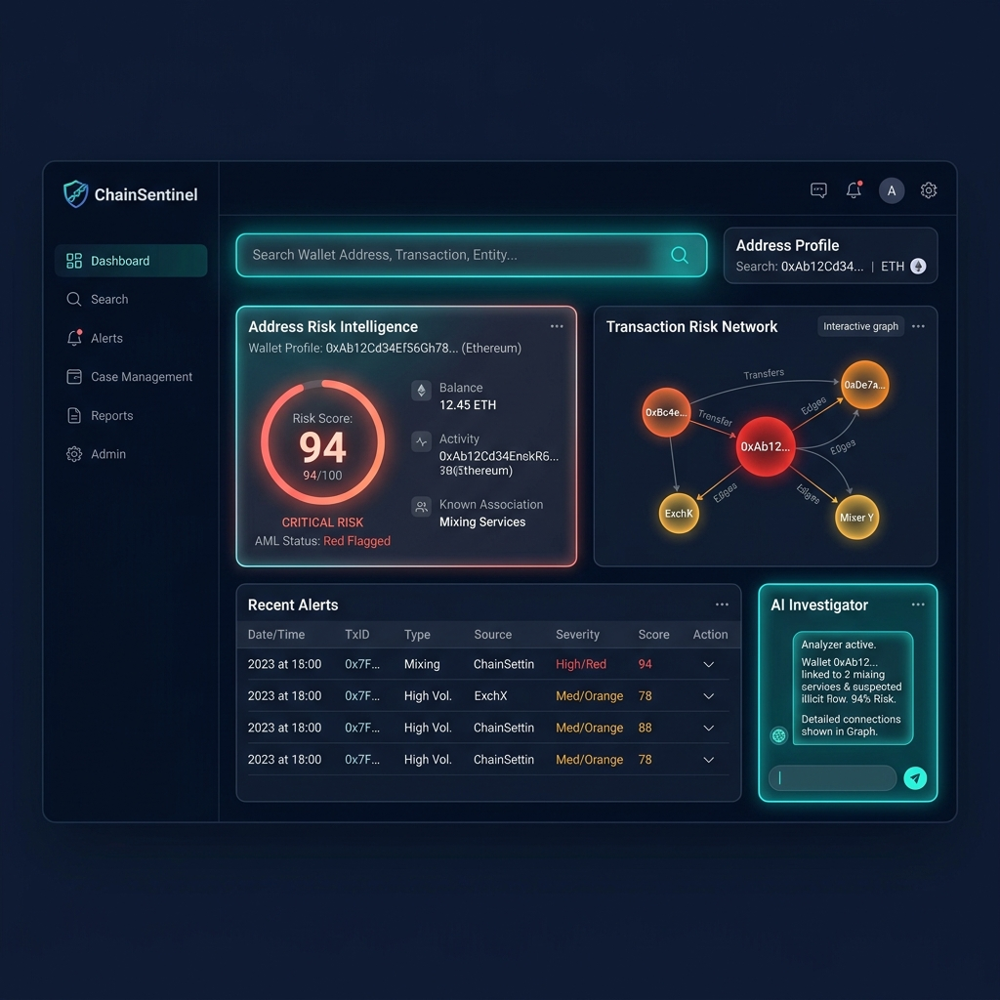

# ChainSentinel AML Intelligence Platform




ChainSentinel is an enterprise-grade Crypto Anti-Money Laundering (AML) Intelligence Platform designed for professional blockchain investigators, compliance officers, and threat analysts. It provides advanced tools for tracking funds, scoring risks, detecting anomalous behaviors, and generating compliance-ready structural reports (SAR).

Inspired by commercial tools like Chainalysis Reactor and TRM Labs, ChainSentinel is built on a scalable, high-performance tech stack.

## ✨ Core Capabilities

- **Omni-Chain Analysis**: Natively supports 11+ networks including Ethereum, Bitcoin, Binance Smart Chain, Tron, Solana, Polygon, Arbitrum, Optimism, Base, Litecoin, and Dogecoin.
- **AI-Powered Investigator**: Integration with Large Language Models (OpenAI or local Ollama) to automatically summarize investigative findings, translate complex blockchain traces, and draft Suspicious Activity Reports (SAR).
- **ML Anomaly Detection**: Uses Isolation Forests and DBSCAN clustering to algorithmically detect structuring (smurfing), layering, anomalous fund flows, and identify address behavioral clusters.
- **Advanced Heuristics Engine**: Evaluates addresses against a catalog of 30+ strict risk factors, instantly flagging Tornado Cash interaction, Darknet exposure, cross-chain bridges, peel chains, and OFAC/EU/UK sanctions list matches.
- **Interactive Graph Intelligence**: Navigate complex transaction trees with full visual graph exploration (powered by Cytoscape) supporting custom BFS depth expansion and inter-address pathway tracing.
- **Automated Reporting**: Export detailed PDF reports and executive summaries suitable for FinCEN or localized regulatory compliance teams.

## 🏗️ Architecture

ChainSentinel is constructed using Clean Architecture principles to ensure high maintainability, testability, and future scalability.

### Tech Stack
* **Backend**: Python 3.11, FastAPI, SQLAlchemy 2.0 (Async), Pydantic v2
* **Storage**: PostgreSQL (Relational), Neo4j (Graph traversal), Redis (Caching & Task Broker)
* **Frontend**: React 18, TypeScript, Vite, TailwindCSS, Cytoscape.js, Framer Motion
* **Asynchronous Jobs**: Celery (Metrics computation, PDF generation)
* **Infrastructure**: Docker, Docker Compose, GitHub Actions (CI/CD)

## 📂 Project Structure

```text
chainsentinel/
├── backend/                  # FastAPI Application
│   ├── app/
│   │   ├── api/              # RESTful Endpoints (FastAPI Routers)
│   │   ├── core/             # Auth, config, database initialization
│   │   ├── domain/           # Core business logic (Blockchain, Risk factors, ML models)
│   │   ├── models/           # SQLAlchemy ORM Models
│   │   ├── providers/        # Blockchain Data Providers (API Clients)
│   │   ├── schemas/          # Pydantic validation schemas
│   │   ├── services/         # Orchestration Services
│   │   └── tasks/            # Celery Background Workers
│   ├── docker/               # PostgreSQL & Nginx config files
│   ├── pyproject.toml
│   └── requirements.txt
├── frontend/                 # React UI (Vite)
│   ├── src/
│   ├── package.json
│   └── vite.config.ts
└── docker-compose.yml        # Full cluster local deployment
```

## 🚀 Getting Started

### Prerequisites
* Docker and Docker Compose
* Make (optional, but recommended for shortcuts)
* Node.js 20+ (if running frontend outside Docker)

### Environment Variables
Duplicate the `.env.example` in the backend folder to `.env` and configure it:
```bash
cp backend/.env.example backend/.env
```

*Note: For the AML AI Investigator capabilities, supply either an `OPENAI_API_KEY` or an `OLLAMA_BASE_URL` in the environment configuration.*

### Running via Docker Compose

1. **Spin up the entire stack** (PostgreSQL, Neo4j, Redis, Backend API, Celery Workers, Nginx Proxy)
```bash
make up
```
*(Or use `docker-compose -f docker-compose.dev.yml up -d --build`)*

2. **Run database migrations**
```bash
make migrate
```

3. **Verify running services**
* Backend API Documentation: `http://localhost:8000/docs`
* Neo4j Browser: `http://localhost:7474`
* React Frontend: `http://localhost:3000` (When dev server is active)

## 🛡️ Risk Assessment Engine

The `RiskEngine` calculates a 0-100 score utilizing weighted factors categorized into:
* **Sanctions**: Automatic intersection against known OFAC SDN, UK HMT, and EU lists.
* **Mixing/Obfuscation**: Detects Tornado Cash, Sinbad, or generic CoinJoin patterns.
* **Structural Patterns**: Fan-in/out, P2P circular transactions, dusting.
* **Behavioral Analysis**: Peeling chains, rapid cross-chain bridge hopping.
* **Machine Learning**: Identifies statistical outliers using multi-dimensional metric anomalies (total volume, time correlation, interval variance).

## 📄 License

This project is licensed under the MIT License - see the [LICENSE](LICENSE) file for details.
